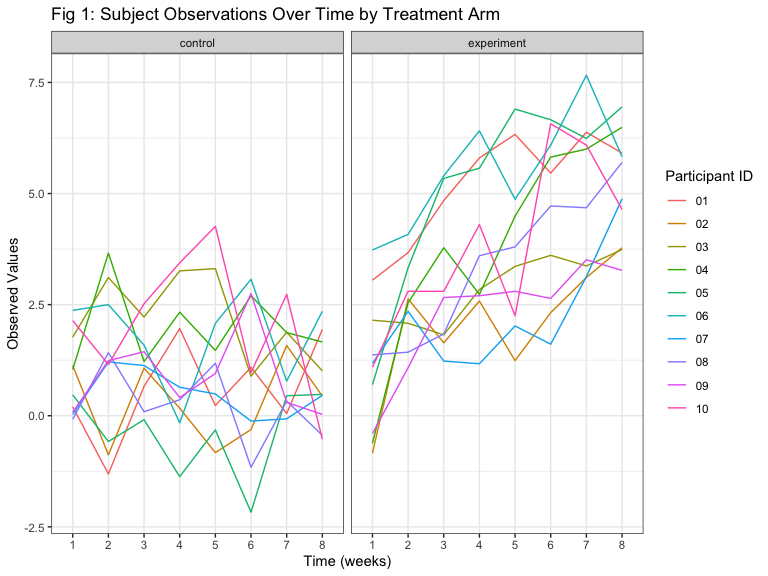

p8105\_hw5\_jys2136
================
Jocelyn Sun
11/17/2021

``` r
library(tidyverse)
library(p8105.datasets)
library(viridis)

knitr::opts_chunk$set(
  echo = TRUE,
  message = FALSE,
  warning = FALSE,
  fig.width = 8,
  fig.height = 6,
  out.width = "90%"
)

scale_colour_discrete = scale_color_viridis_d
scale_fill_discrete = scale_fill_viridis_d

theme_set(theme_bw()) + theme(axis.text.x = element_text(size = 9),
                              axis.text.y = element_text(size = 9),
                              legend.position = "bottom")
```

# Problem 1

``` r
homicide_df = 
  read_csv("homicide-data.csv",  na = c("", "Unknown")) %>% 
  mutate(city_state = str_c(city, state),
         resolution = case_when(
           disposition == "Closed without arrest" ~ "unsolved",
           disposition == "Open/No arrest" ~ "unsolved",
           disposition == "Closed by arrest" ~ "solved"
         )) %>% 
  relocate(city_state) %>%
  filter(city_state != "TulsaAL")
```

Focusing on Baltimore, MD

``` r
baltimore_df = 
  homicide_df %>% 
  filter(city_state == "BaltimoreMD")


baltimore_summary =
  baltimore_df %>% 
  summarise(
    unsolved = sum(resolution == "unsolved"),
    n = n()
    )


baltimore_test = 
  prop.test(
    x = baltimore_summary %>% pull(unsolved),
    n = baltimore_summary %>% pull(n))


baltimore_test %>% 
  broom::tidy() %>% 
  knitr::kable()
```

|  estimate | statistic | p.value | parameter |  conf.low | conf.high | method                                               | alternative |
|----------:|----------:|--------:|----------:|----------:|----------:|:-----------------------------------------------------|:------------|
| 0.6455607 |   239.011 |       0 |         1 | 0.6275625 | 0.6631599 | 1-sample proportions test with continuity correction | two.sided   |

``` r
prop_test_function = function(city_df){
  
  city_summary = 
    city_df %>% 
      summarise(
        unsolved = sum(resolution == "unsolved"),
        n = n()
      )
  
  city_test = 
    prop.test(
      x = city_summary %>% pull(unsolved),
      n = city_summary %>% pull(n)
    )
  
  return(city_test)
  
}

# trying for another city 
homicide_df %>% 
  filter(city_state == "AlbuquerqueNM") %>% 
  prop_test_function() %>% 
  broom::tidy() %>% 
  knitr::kable()
```

|  estimate | statistic |  p.value | parameter |  conf.low | conf.high | method                                               | alternative |
|----------:|----------:|---------:|----------:|----------:|----------:|:-----------------------------------------------------|:------------|
| 0.3862434 |  19.11376 | 1.23e-05 |         1 | 0.3372604 | 0.4375766 | 1-sample proportions test with continuity correction | two.sided   |

``` r
results_df = 
  homicide_df %>%
  nest(data = uid:resolution) %>%
  mutate(
    test_results = map(data, prop_test_function),
    tidy_results = map(test_results, broom::tidy)
    ) %>% 
    select(city_state, tidy_results) %>% 
    unnest(tidy_results) %>% 
    select(city_state, estimate, starts_with("conf"))

head(results_df) %>% 
  knitr::kable()
```

| city\_state   |  estimate |  conf.low | conf.high |
|:--------------|----------:|----------:|----------:|
| AlbuquerqueNM | 0.3862434 | 0.3372604 | 0.4375766 |
| AtlantaGA     | 0.3833505 | 0.3528119 | 0.4148219 |
| BaltimoreMD   | 0.6455607 | 0.6275625 | 0.6631599 |
| Baton RougeLA | 0.4622642 | 0.4141987 | 0.5110240 |
| BirminghamAL  | 0.4337500 | 0.3991889 | 0.4689557 |
| BostonMA      | 0.5048860 | 0.4646219 | 0.5450881 |

``` r
results_df %>% 
  filter(city_state != "TulsaAL") %>% 
  mutate(city_state = fct_reorder(city_state, estimate)) %>% 
  ggplot(aes(x = city_state, y = estimate)) +
  geom_point() +
  geom_errorbar(aes(ymin = conf.low, ymax = conf.high)) +  
  theme(axis.text.x = element_text(size = 7, angle = 90, vjust = 0.5, hjust = 1))
```


# Problem 2

``` r
longstudy_df = 
  tibble(path = list.files("./data", full.names = TRUE)) %>% 
  mutate(data = purrr::map(.x = path, ~read_csv(.x))) %>% 
  unnest(data) %>%
  separate(path, c("dot", "folder", "txt"), sep = "/") %>%
  separate(txt, c("txt_arm","sub_id", "file")) %>%
  select(-c("dot", "folder", "file")) %>%
  pivot_longer(
    week_1:week_8, 
    names_to = "week", 
    names_prefix = "week_",
    values_to = "values"
  ) %>%
  mutate(
    week = as.factor(week)
  )

knitr::kable(longstudy_df, caption  = "**Table 1: Finalized Longitudinal Study Dataframe**")
```

| txt\_arm | sub\_id | week | values |
|:---------|:--------|:-----|-------:|
| con      | 01      | 1    |   0.20 |
| con      | 01      | 2    |  -1.31 |
| con      | 01      | 3    |   0.66 |
| con      | 01      | 4    |   1.96 |
| con      | 01      | 5    |   0.23 |
| con      | 01      | 6    |   1.09 |
| con      | 01      | 7    |   0.05 |
| con      | 01      | 8    |   1.94 |
| con      | 02      | 1    |   1.13 |
| con      | 02      | 2    |  -0.88 |
| con      | 02      | 3    |   1.07 |
| con      | 02      | 4    |   0.17 |
| con      | 02      | 5    |  -0.83 |
| con      | 02      | 6    |  -0.31 |
| con      | 02      | 7    |   1.58 |
| con      | 02      | 8    |   0.44 |
| con      | 03      | 1    |   1.77 |
| con      | 03      | 2    |   3.11 |
| con      | 03      | 3    |   2.22 |
| con      | 03      | 4    |   3.26 |
| con      | 03      | 5    |   3.31 |
| con      | 03      | 6    |   0.89 |
| con      | 03      | 7    |   1.88 |
| con      | 03      | 8    |   1.01 |
| con      | 04      | 1    |   1.04 |
| con      | 04      | 2    |   3.66 |
| con      | 04      | 3    |   1.22 |
| con      | 04      | 4    |   2.33 |
| con      | 04      | 5    |   1.47 |
| con      | 04      | 6    |   2.70 |
| con      | 04      | 7    |   1.87 |
| con      | 04      | 8    |   1.66 |
| con      | 05      | 1    |   0.47 |
| con      | 05      | 2    |  -0.58 |
| con      | 05      | 3    |  -0.09 |
| con      | 05      | 4    |  -1.37 |
| con      | 05      | 5    |  -0.32 |
| con      | 05      | 6    |  -2.17 |
| con      | 05      | 7    |   0.45 |
| con      | 05      | 8    |   0.48 |
| con      | 06      | 1    |   2.37 |
| con      | 06      | 2    |   2.50 |
| con      | 06      | 3    |   1.59 |
| con      | 06      | 4    |  -0.16 |
| con      | 06      | 5    |   2.08 |
| con      | 06      | 6    |   3.07 |
| con      | 06      | 7    |   0.78 |
| con      | 06      | 8    |   2.35 |
| con      | 07      | 1    |   0.03 |
| con      | 07      | 2    |   1.21 |
| con      | 07      | 3    |   1.13 |
| con      | 07      | 4    |   0.64 |
| con      | 07      | 5    |   0.49 |
| con      | 07      | 6    |  -0.12 |
| con      | 07      | 7    |  -0.07 |
| con      | 07      | 8    |   0.46 |
| con      | 08      | 1    |  -0.08 |
| con      | 08      | 2    |   1.42 |
| con      | 08      | 3    |   0.09 |
| con      | 08      | 4    |   0.36 |
| con      | 08      | 5    |   1.18 |
| con      | 08      | 6    |  -1.16 |
| con      | 08      | 7    |   0.33 |
| con      | 08      | 8    |  -0.44 |
| con      | 09      | 1    |   0.08 |
| con      | 09      | 2    |   1.24 |
| con      | 09      | 3    |   1.44 |
| con      | 09      | 4    |   0.41 |
| con      | 09      | 5    |   0.95 |
| con      | 09      | 6    |   2.75 |
| con      | 09      | 7    |   0.30 |
| con      | 09      | 8    |   0.03 |
| con      | 10      | 1    |   2.14 |
| con      | 10      | 2    |   1.15 |
| con      | 10      | 3    |   2.52 |
| con      | 10      | 4    |   3.44 |
| con      | 10      | 5    |   4.26 |
| con      | 10      | 6    |   0.97 |
| con      | 10      | 7    |   2.73 |
| con      | 10      | 8    |  -0.53 |
| exp      | 01      | 1    |   3.05 |
| exp      | 01      | 2    |   3.67 |
| exp      | 01      | 3    |   4.84 |
| exp      | 01      | 4    |   5.80 |
| exp      | 01      | 5    |   6.33 |
| exp      | 01      | 6    |   5.46 |
| exp      | 01      | 7    |   6.38 |
| exp      | 01      | 8    |   5.91 |
| exp      | 02      | 1    |  -0.84 |
| exp      | 02      | 2    |   2.63 |
| exp      | 02      | 3    |   1.64 |
| exp      | 02      | 4    |   2.58 |
| exp      | 02      | 5    |   1.24 |
| exp      | 02      | 6    |   2.32 |
| exp      | 02      | 7    |   3.11 |
| exp      | 02      | 8    |   3.78 |
| exp      | 03      | 1    |   2.15 |
| exp      | 03      | 2    |   2.08 |
| exp      | 03      | 3    |   1.82 |
| exp      | 03      | 4    |   2.84 |
| exp      | 03      | 5    |   3.36 |
| exp      | 03      | 6    |   3.61 |
| exp      | 03      | 7    |   3.37 |
| exp      | 03      | 8    |   3.74 |
| exp      | 04      | 1    |  -0.62 |
| exp      | 04      | 2    |   2.54 |
| exp      | 04      | 3    |   3.78 |
| exp      | 04      | 4    |   2.73 |
| exp      | 04      | 5    |   4.49 |
| exp      | 04      | 6    |   5.82 |
| exp      | 04      | 7    |   6.00 |
| exp      | 04      | 8    |   6.49 |
| exp      | 05      | 1    |   0.70 |
| exp      | 05      | 2    |   3.33 |
| exp      | 05      | 3    |   5.34 |
| exp      | 05      | 4    |   5.57 |
| exp      | 05      | 5    |   6.90 |
| exp      | 05      | 6    |   6.66 |
| exp      | 05      | 7    |   6.24 |
| exp      | 05      | 8    |   6.95 |
| exp      | 06      | 1    |   3.73 |
| exp      | 06      | 2    |   4.08 |
| exp      | 06      | 3    |   5.40 |
| exp      | 06      | 4    |   6.41 |
| exp      | 06      | 5    |   4.87 |
| exp      | 06      | 6    |   6.09 |
| exp      | 06      | 7    |   7.66 |
| exp      | 06      | 8    |   5.83 |
| exp      | 07      | 1    |   1.18 |
| exp      | 07      | 2    |   2.35 |
| exp      | 07      | 3    |   1.23 |
| exp      | 07      | 4    |   1.17 |
| exp      | 07      | 5    |   2.02 |
| exp      | 07      | 6    |   1.61 |
| exp      | 07      | 7    |   3.13 |
| exp      | 07      | 8    |   4.88 |
| exp      | 08      | 1    |   1.37 |
| exp      | 08      | 2    |   1.43 |
| exp      | 08      | 3    |   1.84 |
| exp      | 08      | 4    |   3.60 |
| exp      | 08      | 5    |   3.80 |
| exp      | 08      | 6    |   4.72 |
| exp      | 08      | 7    |   4.68 |
| exp      | 08      | 8    |   5.70 |
| exp      | 09      | 1    |  -0.40 |
| exp      | 09      | 2    |   1.08 |
| exp      | 09      | 3    |   2.66 |
| exp      | 09      | 4    |   2.70 |
| exp      | 09      | 5    |   2.80 |
| exp      | 09      | 6    |   2.64 |
| exp      | 09      | 7    |   3.51 |
| exp      | 09      | 8    |   3.27 |
| exp      | 10      | 1    |   1.09 |
| exp      | 10      | 2    |   2.80 |
| exp      | 10      | 3    |   2.80 |
| exp      | 10      | 4    |   4.30 |
| exp      | 10      | 5    |   2.25 |
| exp      | 10      | 6    |   6.57 |
| exp      | 10      | 7    |   6.09 |
| exp      | 10      | 8    |   4.64 |

**Table 1: Finalized Longitudinal Study Dataframe**

Spaghetti plot

``` r
longstudy_df %>% 
  mutate(txt_arm = recode(txt_arm, 
                          "con" = "control",
                          "exp" = "experiment")) %>%
  ggplot(aes(x = week, y = values, group = sub_id, color = sub_id)) + 
  geom_line() + 
  labs(
    title = "Fig 1: Subject Observations Over Time by Treatment Arm",
    x = "Time (weeks)",
    y = "Observed Values"
  ) + 
  scale_color_hue(name = "Participant ID") +
  facet_grid(. ~ txt_arm)
```



#### Data Observations

In general, for all participants, the observed values of the experiment
arm over time are higher than the control arm. Although observed values
of some participants in the experiment arm at week 1 may have started
out lower than the observed values in the control arm, all observed
values in the experiment arm are greater than the observed values of the
control arm at week 8.

# Problem 3

``` r
set.seed(10)

iris_with_missing = iris %>% 
  map_df(~replace(.x, sample(1:150, 20), NA)) %>%
  mutate(Species = as.character(Species)) %>%
  janitor::clean_names()
```

``` r
iris_clean = function(x){
    
  if (is.numeric(x)) {
    x = replace_na(x, mean(x, na.rm = TRUE))
  } 
  else if (is.character(x)) {
       x = replace_na(x, "virginica")
  }
  
}

iris_df = map(iris_with_missing, iris_clean) %>% 
  as_tibble() 

knitr::kable(iris_df, caption  = "**Table 2: Finalized Iris Dataframe**")
```

| sepal\_length | sepal\_width | petal\_length | petal\_width | species    |
|--------------:|-------------:|--------------:|-------------:|:-----------|
|      5.100000 |     3.500000 |      1.400000 |     0.200000 | setosa     |
|      4.900000 |     3.000000 |      1.400000 |     0.200000 | setosa     |
|      4.700000 |     3.200000 |      1.300000 |     0.200000 | setosa     |
|      4.600000 |     3.100000 |      1.500000 |     1.192308 | setosa     |
|      5.000000 |     3.600000 |      1.400000 |     0.200000 | setosa     |
|      5.400000 |     3.900000 |      1.700000 |     0.400000 | setosa     |
|      5.819231 |     3.400000 |      1.400000 |     0.300000 | setosa     |
|      5.000000 |     3.400000 |      1.500000 |     0.200000 | setosa     |
|      4.400000 |     2.900000 |      1.400000 |     0.200000 | setosa     |
|      4.900000 |     3.100000 |      3.765385 |     0.100000 | setosa     |
|      5.400000 |     3.075385 |      1.500000 |     0.200000 | setosa     |
|      4.800000 |     3.400000 |      1.600000 |     0.200000 | setosa     |
|      5.819231 |     3.075385 |      1.400000 |     0.100000 | setosa     |
|      4.300000 |     3.000000 |      3.765385 |     0.100000 | setosa     |
|      5.819231 |     4.000000 |      3.765385 |     0.200000 | setosa     |
|      5.700000 |     4.400000 |      1.500000 |     0.400000 | setosa     |
|      5.400000 |     3.900000 |      1.300000 |     0.400000 | setosa     |
|      5.100000 |     3.500000 |      1.400000 |     1.192308 | setosa     |
|      5.700000 |     3.800000 |      1.700000 |     0.300000 | setosa     |
|      5.100000 |     3.800000 |      1.500000 |     1.192308 | setosa     |
|      5.400000 |     3.400000 |      1.700000 |     0.200000 | setosa     |
|      5.100000 |     3.700000 |      1.500000 |     0.400000 | virginica  |
|      4.600000 |     3.600000 |      1.000000 |     0.200000 | setosa     |
|      5.819231 |     3.300000 |      3.765385 |     0.500000 | setosa     |
|      4.800000 |     3.400000 |      1.900000 |     0.200000 | virginica  |
|      5.000000 |     3.000000 |      3.765385 |     0.200000 | setosa     |
|      5.000000 |     3.400000 |      1.600000 |     0.400000 | virginica  |
|      5.200000 |     3.500000 |      1.500000 |     0.200000 | setosa     |
|      5.819231 |     3.400000 |      1.400000 |     0.200000 | setosa     |
|      4.700000 |     3.200000 |      1.600000 |     0.200000 | setosa     |
|      4.800000 |     3.100000 |      3.765385 |     0.200000 | setosa     |
|      5.400000 |     3.075385 |      1.500000 |     0.400000 | setosa     |
|      5.200000 |     3.075385 |      1.500000 |     0.100000 | setosa     |
|      5.500000 |     4.200000 |      1.400000 |     0.200000 | setosa     |
|      4.900000 |     3.100000 |      3.765385 |     0.200000 | setosa     |
|      5.000000 |     3.200000 |      1.200000 |     0.200000 | setosa     |
|      5.500000 |     3.500000 |      1.300000 |     0.200000 | setosa     |
|      4.900000 |     3.600000 |      1.400000 |     0.100000 | setosa     |
|      4.400000 |     3.000000 |      1.300000 |     1.192308 | setosa     |
|      5.100000 |     3.400000 |      1.500000 |     0.200000 | setosa     |
|      5.000000 |     3.500000 |      1.300000 |     0.300000 | setosa     |
|      4.500000 |     3.075385 |      1.300000 |     1.192308 | virginica  |
|      4.400000 |     3.200000 |      1.300000 |     0.200000 | setosa     |
|      5.000000 |     3.500000 |      1.600000 |     0.600000 | setosa     |
|      5.100000 |     3.800000 |      1.900000 |     0.400000 | setosa     |
|      4.800000 |     3.000000 |      1.400000 |     0.300000 | virginica  |
|      5.100000 |     3.800000 |      1.600000 |     0.200000 | setosa     |
|      4.600000 |     3.200000 |      3.765385 |     0.200000 | setosa     |
|      5.300000 |     3.700000 |      1.500000 |     0.200000 | setosa     |
|      5.000000 |     3.075385 |      1.400000 |     0.200000 | setosa     |
|      7.000000 |     3.075385 |      4.700000 |     1.400000 | virginica  |
|      6.400000 |     3.200000 |      4.500000 |     1.500000 | versicolor |
|      6.900000 |     3.100000 |      4.900000 |     1.500000 | versicolor |
|      5.500000 |     2.300000 |      4.000000 |     1.300000 | versicolor |
|      6.500000 |     2.800000 |      4.600000 |     1.500000 | versicolor |
|      5.700000 |     2.800000 |      4.500000 |     1.300000 | versicolor |
|      6.300000 |     3.300000 |      4.700000 |     1.600000 | virginica  |
|      4.900000 |     2.400000 |      3.765385 |     1.000000 | versicolor |
|      6.600000 |     2.900000 |      4.600000 |     1.300000 | virginica  |
|      5.200000 |     2.700000 |      3.900000 |     1.400000 | versicolor |
|      5.000000 |     2.000000 |      3.765385 |     1.000000 | versicolor |
|      5.900000 |     3.000000 |      4.200000 |     1.500000 | versicolor |
|      6.000000 |     2.200000 |      4.000000 |     1.192308 | versicolor |
|      6.100000 |     2.900000 |      4.700000 |     1.400000 | versicolor |
|      5.600000 |     2.900000 |      3.600000 |     1.300000 | versicolor |
|      6.700000 |     3.100000 |      4.400000 |     1.400000 | versicolor |
|      5.600000 |     3.000000 |      4.500000 |     1.500000 | versicolor |
|      5.800000 |     3.075385 |      4.100000 |     1.000000 | versicolor |
|      6.200000 |     2.200000 |      4.500000 |     1.500000 | versicolor |
|      5.600000 |     2.500000 |      3.900000 |     1.100000 | versicolor |
|      5.900000 |     3.200000 |      4.800000 |     1.800000 | versicolor |
|      5.819231 |     2.800000 |      4.000000 |     1.300000 | virginica  |
|      6.300000 |     2.500000 |      4.900000 |     1.500000 | versicolor |
|      5.819231 |     2.800000 |      3.765385 |     1.200000 | versicolor |
|      6.400000 |     2.900000 |      4.300000 |     1.300000 | versicolor |
|      6.600000 |     3.000000 |      4.400000 |     1.400000 | versicolor |
|      6.800000 |     2.800000 |      4.800000 |     1.400000 | versicolor |
|      6.700000 |     3.075385 |      5.000000 |     1.192308 | versicolor |
|      6.000000 |     3.075385 |      4.500000 |     1.192308 | versicolor |
|      5.700000 |     2.600000 |      3.500000 |     1.000000 | virginica  |
|      5.500000 |     2.400000 |      3.800000 |     1.100000 | versicolor |
|      5.819231 |     2.400000 |      3.700000 |     1.000000 | versicolor |
|      5.800000 |     2.700000 |      3.900000 |     1.200000 | versicolor |
|      6.000000 |     2.700000 |      5.100000 |     1.600000 | versicolor |
|      5.400000 |     3.000000 |      4.500000 |     1.500000 | versicolor |
|      5.819231 |     3.400000 |      4.500000 |     1.600000 | versicolor |
|      6.700000 |     3.100000 |      4.700000 |     1.192308 | versicolor |
|      5.819231 |     3.075385 |      4.400000 |     1.300000 | versicolor |
|      5.600000 |     3.000000 |      3.765385 |     1.192308 | versicolor |
|      5.500000 |     2.500000 |      4.000000 |     1.192308 | versicolor |
|      5.500000 |     3.075385 |      4.400000 |     1.200000 | versicolor |
|      5.819231 |     3.075385 |      4.600000 |     1.192308 | versicolor |
|      5.800000 |     3.075385 |      4.000000 |     1.192308 | versicolor |
|      5.000000 |     2.300000 |      3.300000 |     1.192308 | virginica  |
|      5.819231 |     2.700000 |      4.200000 |     1.300000 | versicolor |
|      5.700000 |     3.000000 |      4.200000 |     1.200000 | versicolor |
|      5.700000 |     2.900000 |      4.200000 |     1.300000 | versicolor |
|      6.200000 |     2.900000 |      4.300000 |     1.300000 | versicolor |
|      5.100000 |     2.500000 |      3.000000 |     1.192308 | versicolor |
|      5.700000 |     2.800000 |      4.100000 |     1.300000 | virginica  |
|      6.300000 |     3.075385 |      3.765385 |     2.500000 | virginica  |
|      5.800000 |     2.700000 |      5.100000 |     1.900000 | virginica  |
|      7.100000 |     3.000000 |      5.900000 |     2.100000 | virginica  |
|      6.300000 |     2.900000 |      5.600000 |     1.800000 | virginica  |
|      6.500000 |     3.075385 |      5.800000 |     2.200000 | virginica  |
|      7.600000 |     3.000000 |      6.600000 |     2.100000 | virginica  |
|      4.900000 |     2.500000 |      4.500000 |     1.700000 | virginica  |
|      7.300000 |     2.900000 |      6.300000 |     1.800000 | virginica  |
|      6.700000 |     3.075385 |      3.765385 |     1.800000 | virginica  |
|      5.819231 |     3.600000 |      3.765385 |     2.500000 | virginica  |
|      6.500000 |     3.200000 |      5.100000 |     2.000000 | virginica  |
|      5.819231 |     2.700000 |      5.300000 |     1.900000 | virginica  |
|      6.800000 |     3.000000 |      5.500000 |     2.100000 | virginica  |
|      5.700000 |     3.075385 |      5.000000 |     2.000000 | virginica  |
|      5.800000 |     2.800000 |      5.100000 |     2.400000 | virginica  |
|      6.400000 |     3.200000 |      5.300000 |     2.300000 | virginica  |
|      6.500000 |     3.000000 |      3.765385 |     1.800000 | virginica  |
|      7.700000 |     3.800000 |      6.700000 |     1.192308 | virginica  |
|      7.700000 |     2.600000 |      6.900000 |     2.300000 | virginica  |
|      6.000000 |     2.200000 |      5.000000 |     1.500000 | virginica  |
|      5.819231 |     3.200000 |      5.700000 |     1.192308 | virginica  |
|      5.600000 |     3.075385 |      4.900000 |     2.000000 | virginica  |
|      7.700000 |     2.800000 |      6.700000 |     2.000000 | virginica  |
|      6.300000 |     2.700000 |      4.900000 |     1.800000 | virginica  |
|      6.700000 |     3.300000 |      5.700000 |     2.100000 | virginica  |
|      7.200000 |     3.200000 |      6.000000 |     1.800000 | virginica  |
|      6.200000 |     2.800000 |      4.800000 |     1.800000 | virginica  |
|      6.100000 |     3.000000 |      4.900000 |     1.800000 | virginica  |
|      6.400000 |     2.800000 |      5.600000 |     2.100000 | virginica  |
|      7.200000 |     3.000000 |      5.800000 |     1.600000 | virginica  |
|      7.400000 |     2.800000 |      6.100000 |     1.192308 | virginica  |
|      7.900000 |     3.800000 |      3.765385 |     2.000000 | virginica  |
|      6.400000 |     2.800000 |      3.765385 |     2.200000 | virginica  |
|      5.819231 |     2.800000 |      5.100000 |     1.500000 | virginica  |
|      6.100000 |     3.075385 |      5.600000 |     1.400000 | virginica  |
|      5.819231 |     3.000000 |      6.100000 |     2.300000 | virginica  |
|      5.819231 |     3.400000 |      5.600000 |     1.192308 | virginica  |
|      6.400000 |     3.100000 |      5.500000 |     1.192308 | virginica  |
|      6.000000 |     3.000000 |      4.800000 |     1.800000 | virginica  |
|      6.900000 |     3.100000 |      5.400000 |     2.100000 | virginica  |
|      6.700000 |     3.100000 |      5.600000 |     2.400000 | virginica  |
|      6.900000 |     3.100000 |      5.100000 |     2.300000 | virginica  |
|      5.819231 |     2.700000 |      5.100000 |     1.900000 | virginica  |
|      6.800000 |     3.200000 |      3.765385 |     2.300000 | virginica  |
|      6.700000 |     3.300000 |      3.765385 |     2.500000 | virginica  |
|      6.700000 |     3.000000 |      5.200000 |     2.300000 | virginica  |
|      6.300000 |     2.500000 |      5.000000 |     1.900000 | virginica  |
|      6.500000 |     3.000000 |      5.200000 |     2.000000 | virginica  |
|      5.819231 |     3.400000 |      5.400000 |     2.300000 | virginica  |
|      5.900000 |     3.000000 |      5.100000 |     1.800000 | virginica  |

**Table 2: Finalized Iris Dataframe**
